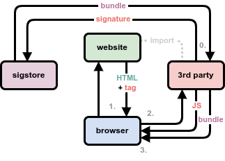

# Sub-Resource Authenticity (SRA) with Sigstore

## Intro

This repo demonstrates a Chrome browser extension that authenticates 
sub-resources (specifically `<script>` imports) on the basis of the 
[Sigstore](https://sigstore.dev) stack. It replaces Sub-Resource 
Integrity (SRI) with a more easily maintained option, based on 
a static OIDC identity, rather than brittle hash values.



## Install

### Sigwasm

To verify signature bundles in the browser, we port the official 
[`sigstore-go`](https://github.com/sigstore/sigstore-go/) 
library to Web Assembly, embedding the Sigstore trust root.

0. [Install Go](https://go.dev/doc/install)
1. `git clone` repo and `cd` into repo
2. Download Sigstore TUF
```
curl -fsSL https://raw.githubusercontent.com/sigstore/root-signing/main/targets/trusted_root.json -o sigwasm/main/trusted_root.json
```
Alternatively, Sigstage TUF
```
curl -fsSL https://raw.githubusercontent.com/sigstore/root-signing-staging/main/targets/trusted_root.json -o sigwasm/main/trusted_root.json
```
3. Compile sigwasm
```
cd sigwasm
go mod tidy
GOOS=js GOARCH=wasm CGO_ENABLED=0 go build -tags=purego -ldflags="-s -w" -o ../chrome-x/sigwasm/sigverify.wasm ./main
```
4. Link Go's `wasm_exec.js`
```
ln -s $GOROOT/lib/wasm/wasm_exec.js ../chrome-x/sigwasm/wasm_exec.js
```

### Chrome Extension

After compiling [sigwasm](#sigwasm), the extension can be loaded into chrome.

1. Launch [chrome://extensions/](chrome://extensions/) in Chrome.
2. Enable **Developer mode**.
3. Click **Load unpacked**, choose `chrome-x` directory.


## Test

### Create Test Files

0. [Install Cosign](https://docs.sigstore.dev/cosign/system_config/installation/)
1. Create signature bundle for `example.js` file
```
cosign sign-blob --yes --new-bundle-format=true --bundle example.js.sigstore.json example.js
```
Log into chosen OIDC issuer when prompted (e.g. GitHub).

(Note: if using Sigstage TUF in the extension, specify Sigstage versions of `--rekor-url` 
and `--fulcio-url`)

2. Create `demo.html` file with a script import and data attributes indicating 
the email and OIDC issuer used to create the signature bundle.
```
<script src="path/to/example.js"
        data-email="test@example.com"
        data-issuer="https://github.com/login/oauth">
```

### Run

1. Host the signature bundle together with `example.js` at `path/to/example.js.sigstore.json`
2. Open `demo.html` with extension installed
3. Clicking the extension icon should show 1 successful validation
